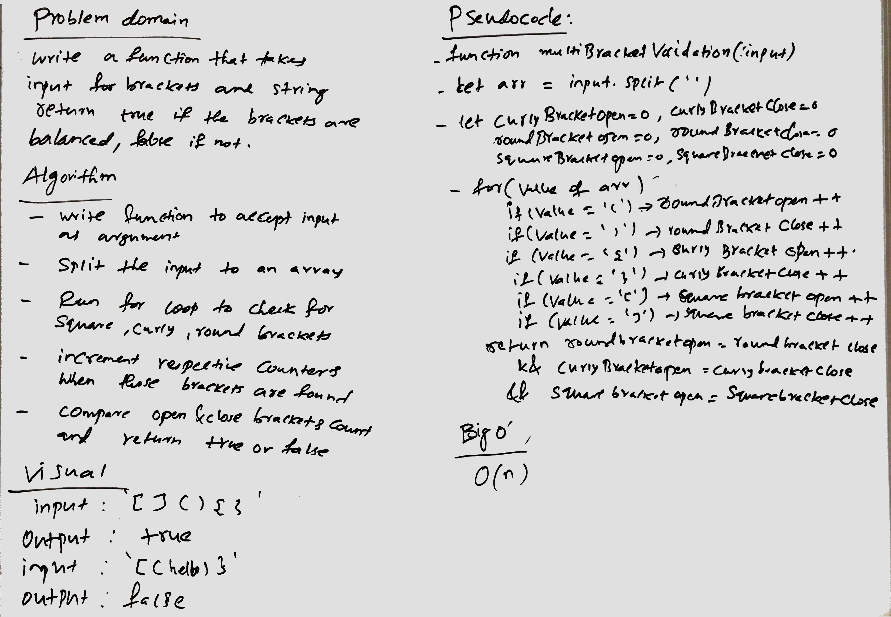

## Travis Link:
https://travis-ci.com/mrebb/data-structures-and-algorithms

## Multi-bracket Validation.

## Challenge
* On your main file, create a function called multiBracketValidation(input).
* Your function should take a string as its only argument, and should return a boolean representing whether or not the brackets in the string are balanced. There are 3 types of brackets:
    * Round Brackets : ()
    * Square Brackets : []
    * Curly Brackets : {}

## Solution
