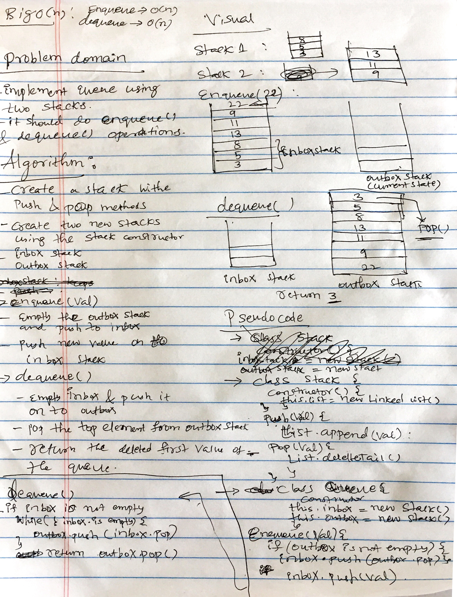

# Queues
Implement a Queue using two Stacks

## Linked list methods
Implement the following methods for the Queue class. Assumption: You have access to 2 Stack instances with push and pop methods.

* enqueue(value) which inserts value into the Queue using a first-in, first-out approach.
* dequeue() which extracts a value from the Queue using a first-in, first-out approach.

## Solution
