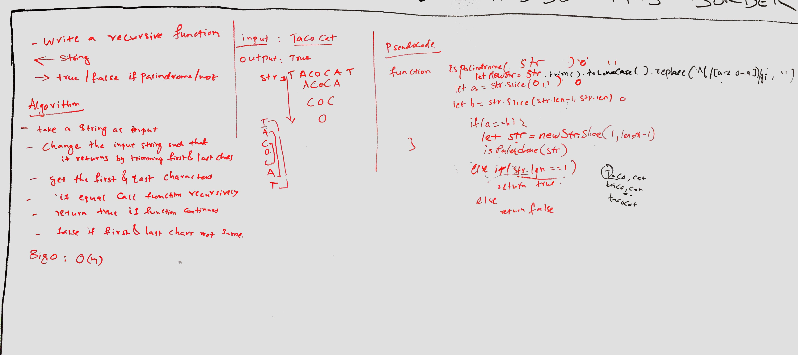

## Travis Link:
https://travis-ci.com/mrebb/data-structures-and-algorithms

## 

## Challenge
* Write a Recursive method that accepts a String and returns true or false depending on if the String is an exact palindrome. isPalindrome function also ignores:
  * Whitespace
  * Capitalization
  * Punctuation

* It only cares about the letters A-Z and digits 0-9

A palindrome is any word that's spelled the same backward and forwad.

isPalindrome("racecar") // returns true  isPalindrome("elephant") // returns false because it's not spelled the same in reverse

should recognize these lines as a palindromes:

```
UFO tofu?
A man, a plan, a canal, Panama!
Was it a car or a cat I saw?
No 'x' in Nixon
Are we not pure? “No, sir!” Panama’s moody Noriega brags. “It is garbage!” Irony dooms a man—a prisoner up to new era.
```


## Solution
