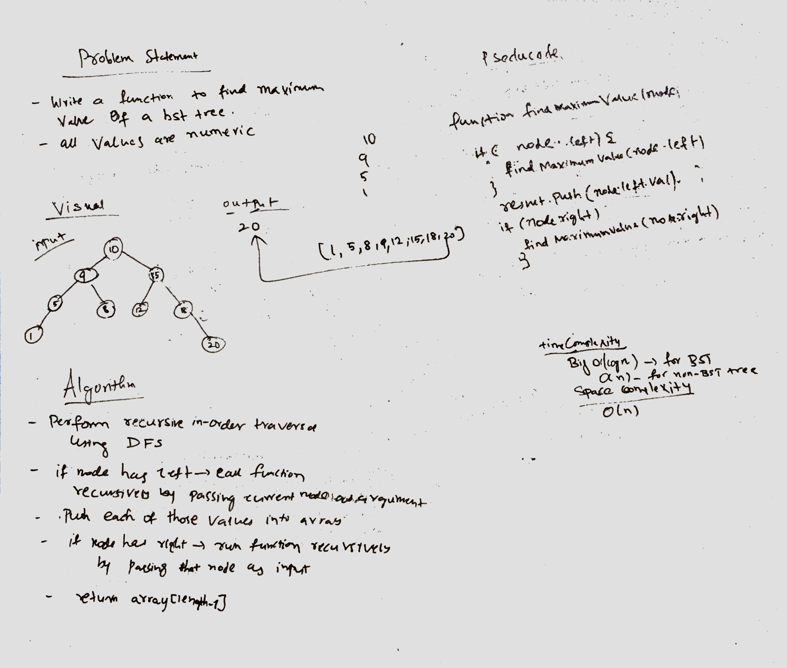

## Travis Link:
https://travis-ci.com/mrebb/data-structures-and-algorithms

## Find the Maximum Value in a Binary Tree

## Challenge
* Write a function called find-maximum-value which takes binary tree as its only imput. Without utilizing any of the built-in methods available to your language, return the maximum value stored in the tree. You can assume that the values stored in the Binary Tree will be numeric.

## Solution
