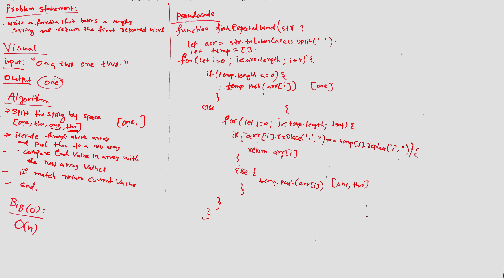

## Travis Link:
https://travis-ci.com/mrebb/data-structures-and-algorithms

## Find the first repeated word in a book.

## Challenge
* Write a function that accepts a lengthy string parameter. Without utilizing any of the built-in library methods available to your language, return the first word to occur more than once in that provided string.

## Solution
